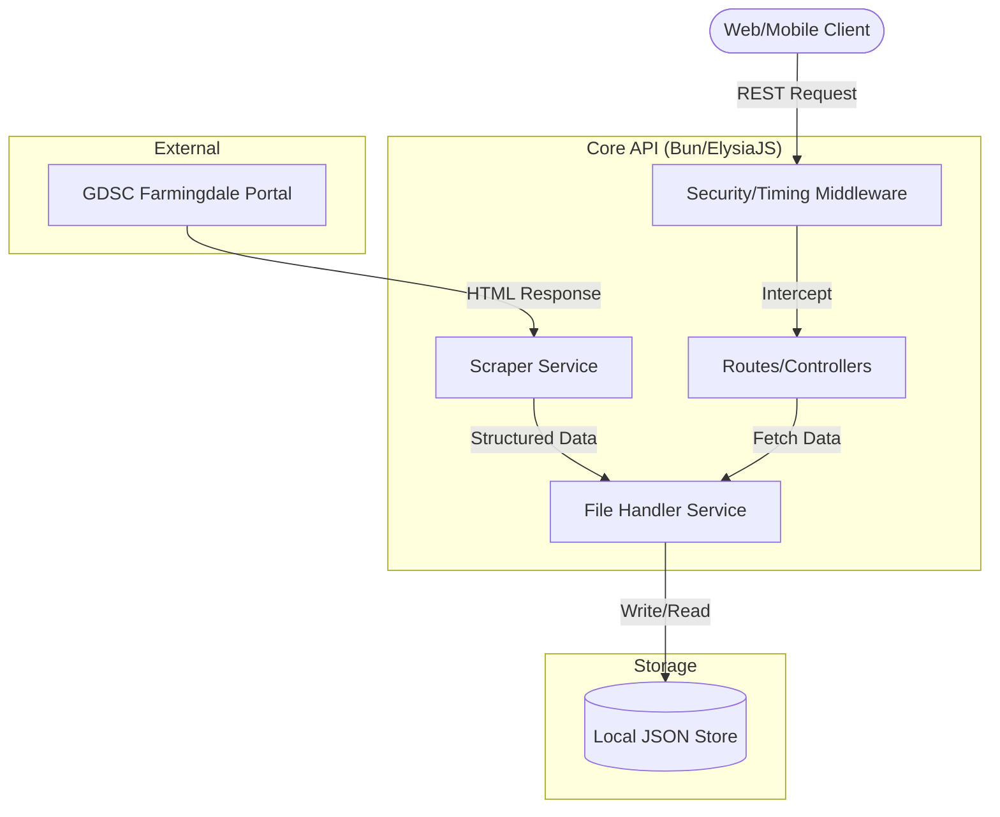
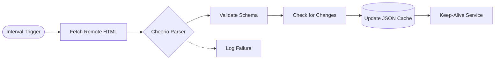

<!--
  Generated by AI-Powered README Generator
  Repository: https://github.com/WomB0ComB0/gdsc-farmingdale-links-api
  Generated: 2026-01-20T03:19:55.652Z
  Format: md
  Style: comprehensive
-->

# GDSC Farmingdale Links API

An automated scraping engine and RESTful API providing structured access to GDG on Campus Farmingdale State College events.


## Table of Contents

- [Overview](#overview)
- [Features](#features)
- [Architecture](#architecture)
- [Quick Start](#quick-start)
- [Usage & Examples](#usage--examples)
- [Configuration](#configuration)
- [API Reference](#api-reference)
- [Development](#development)
- [Troubleshooting](#troubleshooting)
- [Roadmap & Known Issues](#roadmap--known-issues)
- [License & Credits](#license--credits)

## Overview

The **GDSC Farmingdale Links API** serves as a centralized bridge between the official GDG (Google Developer Groups) platform and local community applications. It solves the challenge of programmatic access to event data, which is typically locked behind the community portal's frontend.

By implementing a headless scraping service, this API periodically extracts event metadata—including dates, titles, descriptions, and links—and persists them into a high-performance local cache. This ensures that client applications (mobile apps, websites, or Discord bots) receive instantaneous responses without the latency of real-time scraping.

### Who is this for?
- 🎓 **GDSC Leads & Core Members** looking to automate event promotion.
- 💻 **Farmingdale State College Students** building projects that integrate campus event data.
- 🛠️ **Open Source Contributors** interested in ElysiaJS, Bun, and web scraping patterns.

## Features

### 🔍 Data Acquisition
- ✨ **Automated Scraping**: Uses Cheerio to extract structured data from the official GDSC Farmingdale chapter page.
- ⚡ **Past & Upcoming Events**: Separate logic to categorize events based on their chronological status.
- 🔄 **Periodic Updates**: Background service updates the local JSON store on a configurable schedule.

### 🛡️ Security & Performance
- 🔒 **Hardened Headers**: Integrated `elysiajs-helmet` for CSP, HSTS, and frame protection.
- 🚦 **Rate Limiting**: IP-based throttling to prevent abuse and scraping of the API itself.
- ⏱️ **Server Timing**: Granular monitoring of request lifecycle (parse, transform, handle).
- 🌐 **CORS Management**: Configurable origins for secure cross-domain resource sharing.

### 🛠️ Developer Experience
- 📝 **Auto-Swagger**: Interactive OpenAPI documentation at `/swagger`.
- 🏗️ **PWA Support**: Includes a service worker and manifest for the internal dashboard.
- 🐋 **Docker Ready**: Production-grade `Dockerfile` and `compose.yaml` for containerized deployment.

## Architecture

### System Components
The application follows a modular service-oriented architecture built on the Bun runtime.



### Data Flow (Scraping Lifecycle)
This diagram illustrates the automated data refresh cycle.



### Tech Stack

| Layer | Technology | Purpose |
| :--- | :--- | :--- |
| **Runtime** | Bun | High-performance JS/TS runtime & package manager |
| **Framework** | ElysiaJS | End-to-end type-safe web framework |
| **Parser** | Cheerio | Fast, flexible, and lean implementation of core jQuery for scraping |
| **Tooling** | Biome | Unified linter and formatter (replaces ESLint/Prettier) |
| **Security** | Helmet / Rate-Limit | Security headers and DDoS mitigation |

## Quick Start

### Prerequisites
- [Bun](https://bun.sh/) (v1.1.0 or higher recommended)
- [Git](https://git-scm.com/)

### Installation

1. **Clone the repository**
   ```bash
   git clone https://github.com/WomB0ComB0/gdsc-farmingdale-links-api.git
   cd gdsc-farmingdale-links-api
   ```

2. **Install dependencies**
   ```bash
   bun install
   ```

3. **Configure environment**
   ```bash
   cp .env.example .env
   ```

4. **Run the application**
   ```bash
   bun run dev
   ```

The API will be available at `http://localhost:3000/api/v1`.
The Interactive Swagger docs will be at `http://localhost:3000/swagger`.

## Usage & Examples

### Basic Event Retrieval
To fetch upcoming events for a frontend component:

```typescript
// Using native fetch
const response = await fetch('http://localhost:3000/api/v1/events/upcoming');
const data = await response.json();

console.log(data);
/*
[
  {
    "id": "12345",
    "title": "Introduction to Bun",
    "date": "2024-10-15",
    "link": "https://gdsc.community.dev/...",
    "thumbnail": "..."
  }
]
*/
```

### Health Monitoring
For infrastructure monitoring (e.g., UptimeRobot):

```bash
curl -X GET http://localhost:3000/api/v1/health
```

<details>
<summary>Advanced: Using the Scraper Service manually</summary>

You can trigger a re-scrape by calling the utility route if authenticated or in development mode:
```bash
curl -X POST http://localhost:3000/api/v1/utility/scrape-trigger
```
</details>

## Configuration

The application is configured via environment variables.

| Variable | Required | Default | Description |
| :--- | :--- | :--- | :--- |
| `PORT` | No | `3000` | The port the server listens on |
| `NODE_ENV` | No | `development` | `development`, `production`, or `test` |
| `CORS_ORIGINS` | No | `*` | Comma-separated list of allowed origins |
| `SCRAPE_INTERVAL` | No | `0 0 * * 0` | Cron expression for scraping frequency (Default: Weekly) |
| `RATE_LIMIT_MAX` | No | `100` | Max requests per window per IP |

## API Reference

### Events
| Endpoint | Method | Description |
| :--- | :--- | :--- |
| `/events/past` | `GET` | Retrieve list of historical events |
| `/events/upcoming` | `GET` | Retrieve list of scheduled future events |

### Utility
| Endpoint | Method | Description |
| :--- | :--- | :--- |
| `/health` | `GET` | Returns `200 OK` and system uptime |
| `/info` | `GET` | Returns API version and metadata |

### Common Parameters
- `limit`: (Query) Number of items to return.
- `offset`: (Query) Pagination offset.

## Development

### Project Structure
```text
├── config/             # Environment & global constants
├── data/               # Persistent JSON storage
├── middleware/         # Elysia-compatible middleware
├── public/             # Frontend React components & PWA assets
├── routes/             # API endpoint definitions
├── services/           # Logic for scraping and file I/O
├── types/              # TypeScript interfaces/types
└── utils/              # Shared helper functions
```

### Standards & Linting
We use **Biome** for all formatting and linting.
```bash
# Check for linting errors
bun run lint

# Automatically fix formatting
bun run format
```

### Testing
Tests are written using Bun's native test runner.
```bash
bun test
```

## Troubleshooting

| Error Message | Cause | Solution |
| :--- | :--- | :--- |
| `Error: Too many requests` | IP exceeded rate limit | Wait for the window to reset or whitelist your IP in `config/index.ts`. |
| `Failed to scrape` | GDSC website structure changed | Check `services/scraper.service.ts` and update selectors. |
| `Permission Denied (data/*.json)` | Service cannot write to storage | Ensure the `data/` directory has write permissions for the Bun user. |

## Roadmap & Known Issues

### Roadmap
- [ ] Implement Webhook notifications for new events.
- [ ] Add Redis caching layer for high-traffic scenarios.
- [ ] Develop a dedicated admin dashboard for manual event overrides.
- [ ] Support for multiple chapter scraping (not just Farmingdale).

### Known Limitations
- ⚠️ **Scraping Fragility**: If the GDSC community portal changes its CSS classes, the scraper will fail until selectors are updated.
- ⚠️ **Memory Usage**: For extremely large event histories (>1000 events), the local JSON storage pattern may require migration to a SQLite database.

## License & Credits

### License
This project is licensed under the **MIT License**. See the [LICENSE](LICENSE) file for details.

### Credits
- **Maintainer**: [Mike Odnis](mailto:mikeodnis3242004@gmail.com)
- **Framework**: [ElysiaJS](https://elysiajs.com)
- **Inspiration**: GDSC Farmingdale State College community.

---
*Built with 🦊 and Bun.*